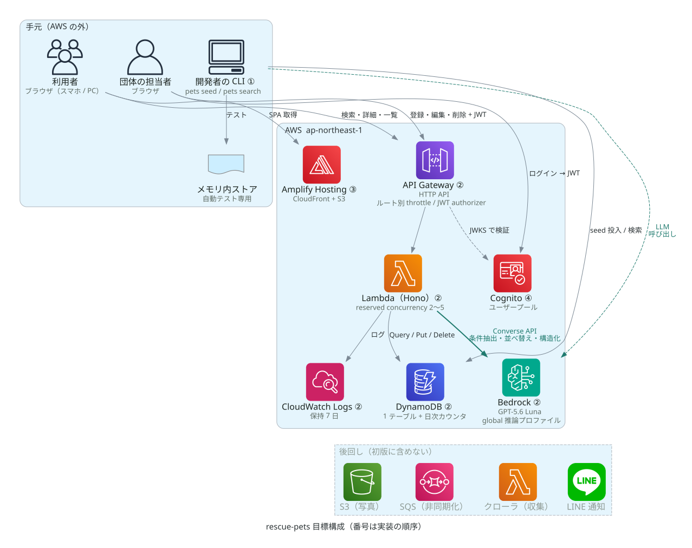
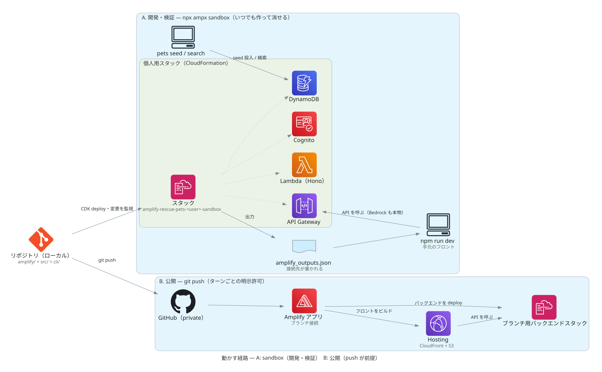

# rescue-pets — 保護犬猫ポータル

全国の保護犬猫の譲渡情報を、1か所で検索できるようにするWebサービスのPoCです。団体ごとにばらばらなサイトで掲載されている現状を、集約検索と元サイトへの送客で補う構想です。**掲載データはすべて架空で、実在の団体・動物の情報は使いません。**

いまどこまで動くかは [ROADMAP](docs/ROADMAP.md) にあります。

## 位置づけと目的

- 収益化を目的にしません。「収集 → AI構造化 → 検索」の集約基盤が動くことをデモとして示します。
- TypeScript / React / Hono / AWS Lambda / CDK / Amplify Gen2 を一貫した構成で使います。機能の数より、CLI・API・画面が同じ処理経路の上に載っていることを優先します。
- 実データ（自治体の公示や愛護団体のサイト）の収集・転載は範囲外とします。権利確認の負担を避けるためです。
- 外部サービスはAWSだけで完結させます（理由は [decisions/002](docs/decisions/002-Cloudflareを使わない.md)）。

## できること（目標）

この節はPoCが目指す機能の一覧で、**現時点ではすべて未実装です**。着手の順序と進み具合は [ROADMAP](docs/ROADMAP.md) を見てください。

利用者向け:

1. **検索** — 「小型で子どもと暮らせる犬」のような自由文で探せます。AIが問い合わせ文から種別・地域・条件を読み取り、候補を確からしい順に返します（仕組みは [search.md](docs/search.md)）。
2. **詳細と送客** — 詳細画面は要点と出典を示し、譲渡の申込みは必ず元サイトへ誘導します。
3. **一覧** — 「地域 × 種別」で絞った一覧を見られます。

団体向け:

4. **登録** — ログインした団体が写真と自由文メモを送ると、AIが「種別・推定年齢・性格・譲渡条件」などを構造化して掲載します。
5. **掲載管理** — 自分の掲載を一覧・編集・削除できます。

運用向け:

6. **CLI** — 見本掲載の構造化（`pets structure`）と投入（`pets seed`）をコマンドラインから実行できます（データの決まりは [data.md](docs/data.md)）。

画面はスマートフォンとPCの両方に対応したレスポンシブなWebです。

## 構成



番号は実装の順序です。緑の矢印だけが課金されるLLM呼び出しで、破線の群は初版に含めません。



A（`npx ampx sandbox`）は実際のAWSアカウント上に開発者ごとのスタックを作り、`amplify_outputs.json` を手元のフロントとCLIが読みます。B（git push → Amplifyアプリ）は公開の経路で、pushが前提です。

図はSVGなので、ブラウザの拡大（⌘+）で文字がぼやけずに読めます。`docs/diagrams/architecture.py` から生成し、SVGは直接編集しません。

## 技術構成

- **フロントエンド**: React + Vite + TypeScript。AWS Amplify Hostingから配信します（実体はCloudFront + S3のマネージド配信）。
- **API**: API Gateway + Lambda。Lambda上のルーティングにはHono（aws-lambdaアダプタ）を使い、ローカルではNodeサーバーで同じアプリを動かします。
- **認証**: Amazon Cognitoのユーザープール（メール + パスワード）。ソーシャルログインは使いません。
- **構成管理**: Amplify Gen2 + AWS CDKをリポジトリ内の正本とします。Amplify Gen2が受け持つのはAuthとHostingで、Amplify Dataは使いません（[decisions/004](docs/decisions/004-Amplify-Dataを使わない.md)）。
- **データベース**: Amazon DynamoDBの1テーブル（[data.md](docs/data.md)、[decisions/001](docs/decisions/001-DynamoDBを採用する.md)）。
- **AI**: Amazon Bedrock上のGPT-5.6 Luna（[search.md](docs/search.md)）。
- **費用**: 無料枠を軸に設計し、botに叩かれても請求額が固定されるようにします（[cost.md](docs/cost.md)）。

## 動かし方

```sh
npm install
npm run dev      # フロントエンド開発サーバー
npm run dev:api  # APIローカル実行（port 3001）
```

コマンドの一覧は [CLI.md](docs/CLI.md) にあります。CLI.mdには**いま動くコマンドだけ**を載せ、未実装の `pets structure` / `pets seed` は [ROADMAP](docs/ROADMAP.md) に予定として書いています。`npx ampx sandbox`（AWSサンドボックス起動。要AWS認証）は実際のAWSアカウントへスタックを作ります。構成図の再生成にはGraphvizとuvが要ります。

## 詳しい文書

| 文書 | 内容 |
|---|---|
| [docs/ROADMAP.md](docs/ROADMAP.md) | 実装の順序と進み具合 |
| [docs/data.md](docs/data.md) | 掲載データの決まりと置き場所 |
| [docs/search.md](docs/search.md) | 検索の仕組み |
| [docs/cost.md](docs/cost.md) | 費用が暴走しない仕組み |
| [docs/decisions/](docs/decisions/) | 設計判断の記録（ADRと呼ばれる形式） |
| [docs/CLI.md](docs/CLI.md) | コマンドの一覧 |
