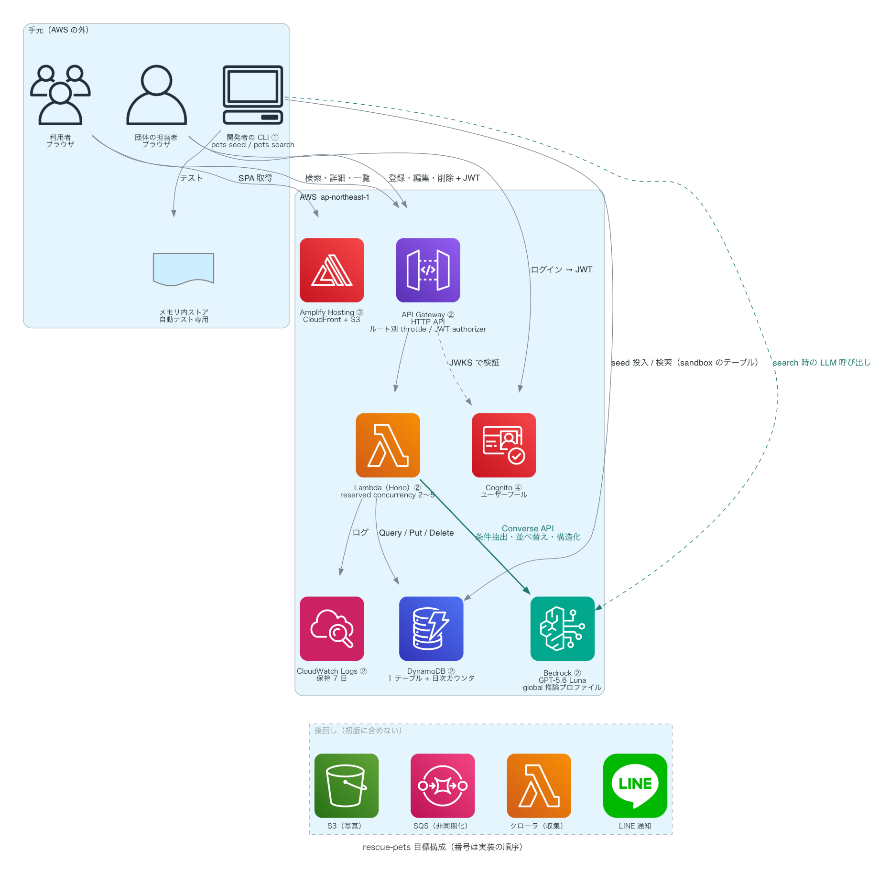
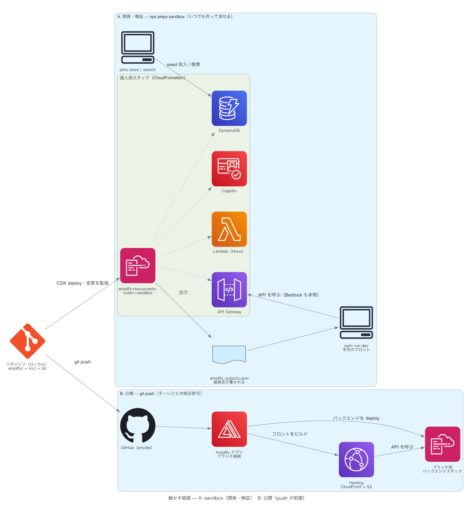

# rescue-pets — 保護犬猫ポータル

更新日: 2026-08-22

全国の保護犬猫の譲渡情報を1か所で検索できるようにする Web サービスの PoC です。掲載データはすべて架空です。仕様は [SPEC.md](SPEC.md) にあります。

現在は雛形の段階で、機能の実装はまだありません。自動テストも未整備です。最初の山は「架空データの投入（seed）と、sandbox で動くバックエンド」で、テストはそこで導入します。

## 構成

番号は実装の順序です。緑の矢印だけが課金される LLM 呼び出しで、破線の群は初版に含めません。

A（`npx ampx sandbox`）は実際の AWS アカウント上に開発者ごとのスタックを作り、`amplify_outputs.json` を手元のフロントと CLI が読みます。B（git push → Amplify アプリ）は公開の経路で、push が前提です。

図は `docs/diagrams/architecture.py` から生成します（コマンドは下の表）。PNG は直接編集しません。

## 技術構成（目標。現状は雛形）

- フロントエンド: React + Vite + TypeScript
- API: Hono（Lambda では aws-lambda アダプタ、ローカルでは Node サーバー）
- インフラ: AWS Amplify Gen2 + AWS CDK（Amplify Data は使いません）
- データベース: Amazon DynamoDB の1テーブル（自動テストだけメモリ内ストア）
- AI: Amazon Bedrock 上の GPT-5.6 Luna（自動テストは実応答を記録して再生します）
- CLI（未実装）: `pets seed` / `pets search`。Lambda と同じロジックで sandbox のテーブルを読み書きします

AWS 以外の外部サービスは使いません。

## コマンド

| 目的 | コマンド |
|---|---|
| 依存のインストール | `npm install` |
| フロントエンド開発サーバー | `npm run dev` |
| API ローカル実行（port 3001） | `npm run dev:api` |
| ビルド | `npm run build` |
| ビルド結果のプレビュー | `npm run preview` |
| lint | `npm run lint` |
| バックエンドの型検査 | `npm run typecheck:backend` |
| AWS サンドボックス起動（要 AWS 認証。クラウド操作のため [AGENTS.md](AGENTS.md) の明示許可ルールの対象） | `npx ampx sandbox` |
| 構成図の再生成（要 Graphviz と uv） | `uv run --with diagrams python docs/diagrams/architecture.py` |
